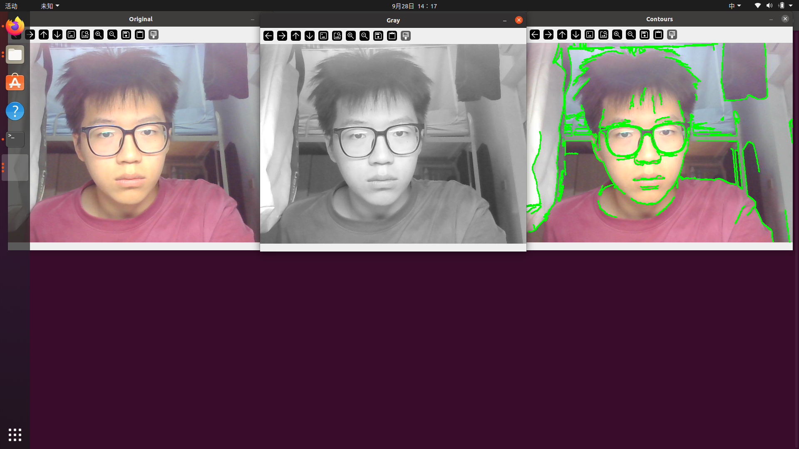
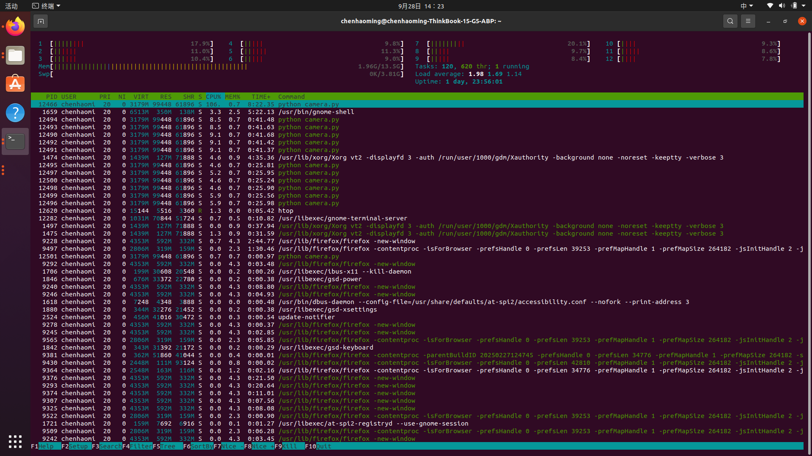

# ROBOCON-Vision-Assignment-1

## 1. System Information

### 1.1 操作系统版本
```text
NAME="Ubuntu"
VERSION="20.04.6 LTS (Focal Fossa)"
ID=ubuntu
ID_LIKE=debian
PRETTY_NAME="Ubuntu 20.04.6 LTS"
VERSION_ID="20.04"
HOME_URL="https://www.ubuntu.com/"
SUPPORT_URL="https://help.ubuntu.com/"
BUG_REPORT_URL="https://bugs.launchpad.net/ubuntu/"
PRIVACY_POLICY_URL="https://www.ubuntu.com/legal/terms-and-policies/privacy-policy"
VERSION_CODENAME=focal
UBUNTU_CODENAME=focal
```
### 1.2 内核版本
```text
5.15.0-139-generic
```
### 1.3 CPU 信息
```text
架构：                                x86_64
CPU 运行模式：                        32-bit, 64-bit
字节序：                              Little Endian
Address sizes:                        48 bits physical, 48 bits virtual
CPU:                                  12
在线 CPU 列表：                       0-11
每个核的线程数：                      2
每个座的核数：                        6
座：                                  1
NUMA 节点：                           1
厂商 ID：                             AuthenticAMD
CPU 系列：                            25
型号：                                80
型号名称：                            AMD Ryzen 5 7530U with Radeon Graphics
步进：                                0
Frequency boost:                      enabled
CPU MHz：                             1354.553
CPU 最大 MHz：                        2000.0000
CPU 最小 MHz：                        1600.0000
BogoMIPS：                            3992.58
虚拟化：                              AMD-V
L1d 缓存：                            192 KiB
L1i 缓存：                            192 KiB
L2 缓存：                             3 MiB
L3 缓存：                             16 MiB
NUMA 节点0 CPU：                      0-11
Vulnerability Gather data sampling:   Not affected
Vulnerability Itlb multihit:          Not affected
Vulnerability L1tf:                   Not affected
Vulnerability Mds:                    Not affected
Vulnerability Meltdown:               Not affected
Vulnerability Mmio stale data:        Not affected
Vulnerability Reg file data sampling: Not affected
Vulnerability Retbleed:               Not affected
Vulnerability Spec rstack overflow:   Mitigation; safe RET, no microcode
Vulnerability Spec store bypass:      Mitigation; Speculative Store Bypass disabled via prctl and seccomp
Vulnerability Spectre v1:             Mitigation; usercopy/swapgs barriers and __user pointer sanitization
Vulnerability Spectre v2:             Mitigation; Retpolines; IBPB conditional; IBRS_FW; STIBP always-on; RSB filling; PBRSB-eIBRS Not affected; BHI Not affected
Vulnerability Srbds:                  Not affected
Vulnerability Tsx async abort:        Not affected
标记：                                fpu vme de pse tsc msr pae mce cx8 apic sep mtrr pge mca cmov pat pse36 clflush mmx fxsr sse sse2 ht syscall nx mmxext fxsr_opt pdpe1gb rdtscp lm constant_tsc rep_go
                                      od nopl nonstop_tsc cpuid extd_apicid aperfmperf rapl pni pclmulqdq monitor ssse3 fma cx16 sse4_1 sse4_2 movbe popcnt aes xsave avx f16c rdrand lahf_lm cmp_legacy sv
                                      m extapic cr8_legacy abm sse4a misalignsse 3dnowprefetch osvw ibs skinit wdt tce topoext perfctr_core perfctr_nb bpext perfctr_llc mwaitx cpb cat_l3 cdp_l3 hw_pstate
                                       ssbd mba ibrs ibpb stibp vmmcall fsgsbase bmi1 avx2 smep bmi2 erms invpcid cqm rdt_a rdseed adx smap clflushopt clwb sha_ni xsaveopt xsavec xgetbv1 xsaves cqm_llc c
                                      qm_occup_llc cqm_mbm_total cqm_mbm_local clzero irperf xsaveerptr rdpru wbnoinvd cppc arat npt lbrv svm_lock nrip_save tsc_scale vmcb_clean flushbyasid decodeassists
                                       pausefilter pfthreshold avic v_vmsave_vmload vgif v_spec_ctrl umip pku ospke vaes vpclmulqdq rdpid overflow_recov succor smca fsrm
```
### 1.4 显卡与图形驱动
```text
06:00.0 VGA compatible controller: Advanced Micro Devices, Inc. [AMD/ATI] Device 15e7 (rev c5)
```
### 1.5 图形会话环境 (Wayland/X11)
```text
06:00.0 VGA compatible controller: Advanced Micro Devices, Inc. [AMD/ATI] Device 15e7 (rev c5)
Subsystem: Lenovo Device 3809
Kernel driver in use: amdgpu
Kernel modules: amdgpu
```
### 1.6 CUDA信息
无
```
## 2. Python Project A

### 环境配置
conda create -n robo_vision_a python=3.8 -y
conda activate robo_vision_a
pip install opencv-python numpy

### 运行命令
cd python_A
python camera.py

### 程序功能
- 打开摄像头，显示原图、灰度图、轮廓图。
- 录制视频保存为 raw_capture.mp4。
- 按 q 或 ESC 退出。

### 截图证据


## 3. Process Observation

### 查找进程命令
ps -ef | grep camera.py
pgrep -f camera.py
top -p <PID>

### htop 截图证据


## 4. Python Project B

### 环境配置
由于 Project A 和 B 的 Python 版本互相冲突，必须使用两个完全隔离的 Conda 环境：
```bash
conda create -n robo_vision_b python=3.9 -y
conda activate robo_vision_b
pip install opencv-python numpy
```
## 5. C++ Manual Build

### 依赖安装
```bash
sudo apt install g++ libopencv-dev libeigen3-dev -y
```
## 6. CMake Build

### CMakeLists.txt 内容
```cmake
cmake_minimum_required(VERSION 3.10)
project(RoboconVision)

set(CMAKE_CXX_STANDARD 14)

# 查找 OpenCV 依赖
find_package(OpenCV REQUIRED)
include_directories(${OpenCV_INCLUDE_DIRS} /usr/include/eigen3)

# 包含头文件目录
include_directories(include)

# 添加可执行文件（源文件在 src 目录里）
add_executable(process_video src/main.cpp src/transform.cpp)

# 链接 OpenCV 库
target_link_libraries(process_video ${OpenCV_LIBS})
```
## 7. Git / GitHub

### 用到的 Git 命令
```bash
# 查看状态
git status
git log --oneline

# 添加和提交
git add .
git commit -m "提交信息"

# 创建并切换分支
git checkout -b feature/gitignore

# 切换回主分支并合并
git checkout master
git merge feature/gitignore

# 推送到 GitHub
git push origin master
```
